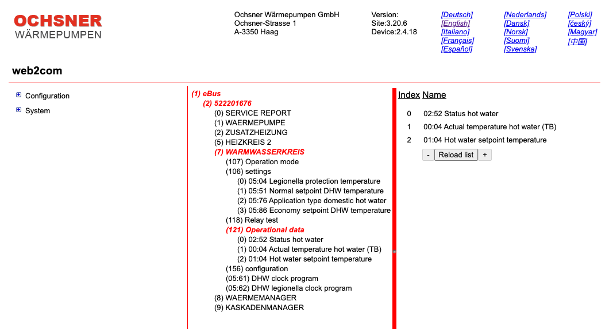

# ioBroker.ochsner-roomterminal

## ochsner-roomterminal Adapter for ioBroker

### Description

This adapter connects to the Ochsner Roomterminal Webserver (web2comm) via SOAP, to both monitor and control your OCHSNER heatpump device.
It offers almost the same _devices and functions_ features to ioBroker, which are available when you access the Roomterminal's web2comm interface with you browser.

During adapter startup, meta data like names, min/max values, units, steps, etc. are read from the device and used during object creation. However, value ranges are neither enforced by the adapter, nor by the web2com interface. It is for information only (e.g. iobroker provides you with a log entry, when values are not within the given range).

OIDs are read in **groups**, which means all ochsner device endpoints, which belong to same group, are read in one request (simultaneously). A specific group is identified via a positive integer number.

Group read request can be triggered in 2 ways:

1. **Via Polling:**  
   Groups, identified with numbers from 0 to 9, are read in a round robin fashion - one after the other. The time between 2 group reads is configured via the _polling intervall_ in seconds. Details, see Instance Configuration below ....
2. Via **ioBroker Message:** 
   Any group read can be triggered via a readGroup iobroker message, which is sent to the adapter instace.

### OID - Address of a device endpoint

All OIDs can be derived from the web2com web page.

> E.g <code>/1/2/7/106/1</code> specifies the _Normal setpoint DWH temperature_ on my heatpump.

> Since OIDs are hierachical, it is recommended to only use OIDs which specifiy as specific single device endpoint. You could also use one level above (e.g. <code>/1/2/7/106</code>), which would read all endpoints below.  However, this feature is not tested!.

### Ochsner Device Status endpoints

There are certain endpoints, which represent **Ochsner Device Status** information. In web2comm, those endpoints are usually under the _operational mode_ group and include the text _Status_ in their name. 
As an example, see <code>/1/2/7/121/0 (Status hot water)</code> in the picture above.

Those endpoints can be marked <code>is status</code> in the OID instance configuration.
When this field is checked, an additional iobroker object is created in the _Status folder_ of the adapter instance. For visualization purposes, it holds the current status of the device endpoint in <u>text form</u>.

### Instance Configuration

#### Options Tab

Requires <code>username</code>, <code>password</code> and <code>IP or hostame</code> of your web2com web interface,
as well as the <code>polling interval</code>, which specifies the time in seconds between subsequent group reads

#### OID Tab

Here you can create and modify a table of OID endpoints. For each **enabled** endpoint, an ioBroker object is created in the _OID_ folder of the adapter instance.

Each OID endpoint has the following configuration fields:

> | Endpoint Name   | Description                                                                                              |
> | :-------------- | :------------------------------------------------------------------------------------------------------- |
> | Enabled         | Only enabled endpoints can be read or updated                                                            |
> | OID             | Address of the device endpoint to read or update - e.g. <code>/1/2/7/106/1</code>                        |
> | Name (optional) | Name of the device endpoint to read or update. If ommitted, roomterminals endpoint info is used instead. |
> | is state        | indicates, that this OID is considered a _Ochnser Device Status_                                         |
> | Group           | group identfier (positive integer number) of the endpoint                                                |

### ioBroker Instance Messages

The adapter supports receiving a <code>readGroup</code> message, in order to trigger a **group read request**, either from the cmd line, or from script. The result is written to the corresponding adapter instance objects.
This allows you to get just-in-time device information, whenever you need them.

#### E.g. read all endpoints, which belong to group 15 ...

1. From command line: `iobroker message ochsner-roomterminal.0 readGroup 15` 
2. From javascript: `await sendToAsync("ochsner-roomterminal.0", 'readGroup', '15');`
3. From blockly:  

### Important Hints

> 1.  This adapter is based on the reverse engineering results on my speific heatpump.
> 2.  **I had to add a group with only one OID**, in order to avoid a situation, when the web2comm interface suddenly stopped providing data back.
> 3.  There were no tests executed on any other endpoints or any other ochsner heatpumps. So enjoy to give it a try with your endpoints on your device :blush: - and don't forget to perform the required tests in your environment
> 4.  The web2comm interface does not give back any error codes, when reading or writing to endpoints, which do not exist.
>     So you have to carefully check, that your OIDs are provided correctly and supported by your ochsner heatpump.

## Changelog

<!--
	Placeholder for the next version (at the beginning of the line):
	### **WORK IN PROGRESS**
-->

### **WORK IN PROGRESS**

-   code cleanup

### 0.0.10 (2024-03-30)

-   added initial description
-   fix OID write index problem

### 0.0.8 (2023-08-24)

-   removed React components
-   NPM packages updates

### 0.0.7 (2023-06-11)

-   updated the newest npm packages

### 0.0.6 (2023-05-20)

-   updated vulnerable packages

### 0.0.5 (2023-03-15)

-   async message support

### 0.0.4 (2023-03-07)

-   groups with names bigger than 9 are reserved for messages

### 0.0.3 (2023-03-07)

-   added message support to trigger group reads

### 0.0.2 (2023-02-18)

-   fixed problem with only having one group

### 0.0.1 (2023-02-16)

-   (armintan) initial release

## License

MIT License

Copyright (c) 2024 Armin Stegerer <Armin.Stegerer@t-online.de>

Permission is hereby granted, free of charge, to any person obtaining a copy
of this software and associated documentation files (the "Software"), to deal
in the Software without restriction, including without limitation the rights
to use, copy, modify, merge, publish, distribute, sublicense, and/or sell
copies of the Software, and to permit persons to whom the Software is
furnished to do so, subject to the following conditions:

The above copyright notice and this permission notice shall be included in all
copies or substantial portions of the Software.

THE SOFTWARE IS PROVIDED "AS IS", WITHOUT WARRANTY OF ANY KIND, EXPRESS OR
IMPLIED, INCLUDING BUT NOT LIMITED TO THE WARRANTIES OF MERCHANTABILITY,
FITNESS FOR A PARTICULAR PURPOSE AND NONINFRINGEMENT. IN NO EVENT SHALL THE
AUTHORS OR COPYRIGHT HOLDERS BE LIABLE FOR ANY CLAIM, DAMAGES OR OTHER
LIABILITY, WHETHER IN AN ACTION OF CONTRACT, TORT OR OTHERWISE, ARISING FROM,
OUT OF OR IN CONNECTION WITH THE SOFTWARE OR THE USE OR OTHER DEALINGS IN THE
SOFTWARE.
